# WORKFLOW.md

How these skills fit together day to day. Every skill in this collection is usable on its own, but they were designed as one loop: **decide → plan → file → build → ship → land**. This document is the map — what to reach for, in what order, what each mode does, and where one skill hands off to the next.

If you only remember one thing: **`statuskit` tells you which of these to run next.** Start there when you sit down and aren't sure.

## The loop at a glance

```
   ORIENT   statuskit ──▶ one next move, routed to the kit that does it
            ▼
   DECIDE   validatekit ──▶ validated / unproven / contradicted
            researchkit ──▶ one recommended option, with cited evidence
            ▼
   PLAN     plankit ──▶ grillkit ──▶ plan doc, stamped `Grilled:`
            ▼
   FILE     issuekit create ──▶ ready / blocked / needs-planning
            ▼
   START    issuekit start ──▶ worktree, ready ──▶ in-progress
            ▼
   BUILD    implementkit ──▶ commitkit ──▶ reviewkit ──▶ verifykit / qakit
            ▼
   SHIP     prkit ──▶ PR open, issue ──▶ in-review
            ▼
   LAND     mergekit start ──▶ mergekit finish ──▶ issuekit close

            gitkit    ┄┄▶ worktree · branch name · base ref · rebase vs merge
                          borrowed by issuekit start, prkit, mergekit, issuekit close
            domainkit ┄┄▶ CONTEXT.md glossary + ADRs, as PLAN settles decisions
```

The same loop, rendered (GitHub only — the ASCII above is what an agent or terminal reader sees):

```mermaid
flowchart TD
    ST["statuskit<br>read-only sweep · crowns one next move"]

    subgraph decide["DECIDE"]
        direction LR
        V["validatekit<br>is it worth building at all?"]
        R["researchkit<br>which option do we pick?"]
    end

    subgraph plan["PLAN"]
        direction LR
        P["plankit"] --> G["grillkit"] --> PD["plan doc<br>stamped Grilled:"]
    end

    F["issuekit create<br>ready / blocked / needs-planning"]
    S["issuekit start<br>worktree · ready to in-progress"]

    subgraph build["BUILD"]
        direction LR
        I["implementkit"] --> C["commitkit"] --> RV["reviewkit"] --> Q["verifykit / qakit"]
    end

    SH["prkit<br>PR open · issue to in-review"]

    subgraph land["LAND"]
        direction LR
        M1["mergekit start"] --> M2["mergekit finish"] --> M3["issuekit close"]
    end

    GK["gitkit<br>worktree · branch name · base ref · rebase vs merge"]
    DK["domainkit<br>CONTEXT.md glossary + ADRs"]

    V --> P
    R --> P
    PD --> F --> S --> I
    Q --> SH --> M1

    ST -.-> F
    ST -.-> S
    ST -.-> I
    ST -.-> SH

    GK -.-> S
    GK -.-> SH
    GK -.-> M1
    GK -.-> M3

    G -.-> DK
```



Read either one top to bottom. Every connector is an arrow pointing the way the work flows: a solid arrow (`──▶`, `▼`) is a step — the next kit you run, or the thing this one produces. A dotted arrow (`┄┄▶`) is a layer being called rather than a step you take.

The dotted edges are not steps in the sequence. `gitkit` is the layer the phases call into: `issuekit start` asks it for a worktree, `prkit` asks for the base ref and gets "rebase" back, `mergekit` asks the same question once the PR is shared and gets "merge", and `issuekit close` has it tear the worktree down. `domainkit` runs the other way — planning settles a term or a hard-to-reverse trade-off, and it writes that down. Neither is usually invoked by name. `statuskit` sits above the loop rather than in it: read-only, launches nothing, and its whole job is telling you which row to jump to, so it can point at any of them.

Three kits stay off the map entirely. `repokit` provisions the label vocabulary the loop depends on — run it once per repo, before any of this. `afkkit` runs the whole BUILD → SHIP span unattended. `handoffkit`, `humankit`, and `skillkit` are invoked on demand.

## Orientation: start with statuskit

`/statuskit` is a read-only sweep of the working tree, open issues, open PRs, and unfiled plans. It prints a one-screen dashboard and crowns exactly one next move, routed to the kit that does it. It never launches anything for you, and each run is a fresh read — no cache, always re-derived from git and GitHub. By default it also saves the dashboard as a gitignored scratch snapshot under `docs/status/`, with the ranked moves as a tickable checklist; add "just print it" to skip the file.

Its priority ladder, when `gh` is available:

| # | What it sees | Where it routes you |
|---|---|---|
| 1 | your PR is red or has changes requested | `mergekit fix` |
| 2 | an in-progress issue whose branch you're on | `implementkit` |
| 3 | orphaned uncommitted work | `commitkit`, then push |
| 4 | a stash | restore or drop it |
| 5 | an unmerged local feature branch | `gitkit` |
| 6 | a stale-tracker signal | `issuekit sync` |
| 7 | a `ready` issue waiting | `issuekit start`, then `implementkit` |
| 8 | an unlabeled or odd-status issue | `issuekit triage` |
| 9 | an unfiled plan, or nothing at all | `issuekit create` or `plankit` |

Without `gh` it falls back to a git-only ladder over the same shape. No repo yet? The move is `plankit`.

## Phase 1 — Decide

Both of these are entry points. Nothing hands off *into* them; they hand off forward into planning.

### validatekit — should this exist at all?

For a product or business idea, not a technical change. It asks a handful of forcing questions one at a time, routes by stage (pre-product / has users, not paying / has paying customers), and grades the evidence you can actually produce into one of three verdicts:

- **Validated** → go to `plankit` and turn the wedge into a plan.
- **Unproven** → go run the real-world assignment it gives you. Come back after, not before.
- **Contradicted** → take the reframe, or go to `plankit` anyway with your eyes open.

Chat output is the deliverable. It writes `docs/validation/validation-<slug>-YYYY-MM-DD.md` only if you say yes. Side projects get an off-ramp: some things don't need validating, they need building.

### researchkit — which option do we pick?

For a technical decision with more than one credible answer: a library, a framework, a service, an architecture. It reads primary sources, cites and dates the evidence, and recommends one. Prints inline by default; writes `docs/research/research-<slug>-YYYY-MM-DD.md` only when you ask.

It does not build prototypes to settle its own hypotheses, and it does not read your codebase for reuse patterns — that's planning work. Leftover uncertainties become the open questions `plankit` and `grillkit` pick up.

## Phase 2 — Plan

The stated three-step flow is **plankit drafts → grillkit hardens → issuekit files**. The plan document is the contract all three read.

### plankit — draft the plan

`/plankit` takes a rough idea through capture → ground (reads the actual repo) → diverge → converge → write → hand off, and produces `docs/plans/plan-<slug>-YYYY-MM-DD.md` with a fixed shape: Context, Design decisions (settled), Approach, Open questions, Non-goals. Keep the body phase- and task-shaped, because `issuekit` slices issues out of it.

It writes no code and files no issues. It also isn't the interrogator — it drafts, then hands to `grillkit`.

### grillkit — harden it

`/grillkit` pressure-tests one decision at a time, each with a recommended answer, until you and it share the same picture. Started from a plan file, it folds the settled decisions back into that same file by default and stamps it:

```
Grilled: YYYY-MM-DD
```

**That stamp is load-bearing.** `issuekit create` reads it as provenance: a grilled plan produces `ready` and `blocked` issues that are safe to work unattended; an ungrilled one produces `needs-planning` issues instead. Skipping the grill doesn't just cost you rigor, it gates you out of `afkkit`.

Started from anything else — a concept, an architecture, a PR — it recaps and asks where the decisions should go.

### domainkit — scribe the model

Invoke `/domainkit` when planning or grilling settles a domain term or a hard-to-reverse trade-off. It maintains two artifacts and asks before writing either:

- `CONTEXT.md` at the repo root — the glossary of the ubiquitous language.
- `docs/adr/adr-NNNN-<slug>-YYYY-MM-DD.md` — decision records, zero-padded and sequential.

The ADR bar is three-part: hard to reverse, surprising without context, and a genuine trade-off. It scribes the model, it doesn't interrogate it — if a term is still genuinely unsettled, go back to `grillkit` rather than writing down a guess.

## Phase 3 — File and start

`issuekit` owns the whole tracker lifecycle in five modes. If the mode isn't clear from your ask, it asks first. Every mutation is previewed before it runs, and it never merges PRs.

| Mode | What it does |
|---|---|
| `issuekit create` | turn a plan document or a plain description into well-formed issues, with parent→child links |
| `issuekit start` | take a `ready` issue into its own worktree and flip it `in-progress` |
| `issuekit close` | once its PR has merged, close the issue, unblock what it was holding up, and tear the worktree down |
| `issuekit sync` | reconcile and repair PR↔issue links after the fact, across the whole tracker |
| `issuekit triage` | report the health of the tracker, then offer fixes you approve |

Issue titles use the same `type(scope): summary` shape as commits, so the tracker and the git log read as one workflow.

### The label vocabulary

Exactly one status label is active at a time. Two pairs carry most of the meaning:

- **`ready` vs `blocked`** is the *parallel-work* pair. `ready` means specified and independent — safe to take into its own worktree right now. `blocked` means it has an unmet prerequisite, named in the body as `Blocked by #N`. The label says *that* it's blocked; the body says *by what*.
- **`needs-planning` vs `ready`** is the *human-gate* pair. `ready` means specified enough to work unattended.

The rest: `triage` (filed, not yet assessed), `in-progress` (being worked in a worktree), `in-review` (PR open), `needs-info`, `wontfix`, `duplicate`. A closed issue needs no `done` label — the closed state is the signal. Type lives in the title, never in a label.

There are only two paths to `ready`: a human grilled its decisions settled, or `issuekit sync` promoted it from `blocked` when its prerequisite landed.

**`issuekit` uses labels, it never creates them.** If a label is missing it stops and points at `repokit`.

### repokit — provision the ground first

Run this once per repo, before the loop:

- `repokit labels` — creates and reconciles the nine lifecycle labels with their canonical names, colors, and descriptions. Re-run safe: missing ones get created, drifted ones get offered an update, matching ones are left alone, and your own non-canonical labels are never touched.
- `repokit about` — infers a one-line About description and topics from the repo's own contents.

The label map is a shared contract with `issuekit`: `repokit` writes them, `issuekit` reads them.

### gitkit — the git layer underneath

You rarely invoke `gitkit` by name; other skills call it. It is the single source of truth for four things, and if you find any of them restated inside another skill, that's a bug:

- **Where a worktree lives** — `$WORKTREE_ROOT/<repo-basename>/<local-branch-name>`, defaulting to `~/worktrees`, always outside the repo. Slashes in a branch name flatten to dashes. A branch has at most one worktree, and lookup is by branch through git, never by guessing at a path.
- **What a branch is called** — `issue-<n>-<slug>` for tracker work, `pr-<n>-<slug>` only for a fork PR that has no local branch yet, and anything the repo already uses otherwise.
- **The base ref** — resolved through a ladder starting at `gh repo view --json defaultBranchRef`. Never assumed to be `main`.
- **Rebase or merge** — rebase a branch you exclusively own and haven't published for review; merge the base into a branch that's under review or shared.

Invoke it directly for worktree housekeeping: "spin up a worktree for this", "where's the worktree for #42", "tear down this worktree", "clean up my worktrees".

## Phase 4 — Build

### implementkit — write the code

Hand it an explicit input: a plan file, an issue (`#42`), or a spec in the prompt. It won't go hunting for one. It picks its build mode by precedence, taking the first tier that answers:

1. **Your prompt** — an explicit "do this TDD" always wins.
2. **Agent instructions** — `CLAUDE.md` or equivalent.
3. **Repo habit** — TDD only when real test infrastructure exists *and* the repo actually ships tests with features. Infra with no habit is not TDD.
4. **Ask once**, and default to straight-through when nobody's there to answer. TDD is the heavier mode and is never imposed silently.

It runs the repo's own test and build/typecheck commands as a done-gate, discovered from `package.json`, `Makefile`, `pyproject.toml`, `justfile`, or CI config. Fixing on red is bounded to roughly three attempts, then it stops rather than green-washing.

It leaves everything **unstaged** and commits nothing. An underspecified input gets bounced back to `grillkit` or `plankit` with the specific gaps named — that's a success, not a failure.

### commitkit — land it in git

Reads the working tree and writes Conventional Commits messages from the actual diff. In a coding session the default is **multiple commits**, one per logical group, and it works autonomously: stages the right files, groups the work, commits, and reports a table. It pauses only for genuine ambiguity — half-finished work, secrets, partially staged files.

The message shape, with a mandatory scope (fallback `repo`) and a required body:

```
type(scope): short imperative summary

one-line summary of why the change was made

- reason/change bullet
- reason/change bullet
```

It never pushes, never amends, and never rewrites history unless you ask. A repo with its own convention in `CONTRIBUTING.md` or an obviously different `git log` style wins over these defaults.

### reviewkit — check the agent's work

Four ordered passes over the diff: convention-fit, agent-slop signatures, requirement-completeness, then correctness. It targets uncommitted work first, then the branch diff against the base from `gitkit`. Findings are ranked by severity with quoted evidence — 🔴 Blocker, 🟡 Should-fix, 🟢 Nit — and the verdict falls out mechanically: **needs-work** with any blocker, **ready-with-fixes** with any should-fix, **ready** with only nits.

It needs the change's stated intent to run the completeness pass; without one it skips that pass rather than inventing a spec. It never edits source and never applies fixes — you take the findings back to an implement step or fix by hand and re-run. Optional report at `docs/reviews/review-<slug>-YYYY-MM-DD.md`, offered but never saved unprompted.

### verifykit and qakit — prove it works

Two different jobs, often both:

- **`verifykit`** drives the feature in a real browser and captures screenshots plus a short GIF into `docs/verify/verify-<slug>-YYYY-MM-DD/`. That bundle's `proof.md` is a hand-off contract: `prkit` reads it and splices it straight into the PR's Proof section. Add `docs/verify/` to `.gitignore` — the assets publish to a hidden git ref instead. Frontend changes only, and it degrades honestly: no browser automation available means a manual capture recipe, not faked proof.
- **`qakit`** writes a manual test plan for a human to run, grounded in the diff, at `docs/qa/qa-<slug>-YYYY-MM-DD.md`. It walks eleven dimensions (happy path, edges, negative, regression, security, data, concurrency, compatibility, accessibility, performance, UX), tags each case by priority, and splits the work honestly: it runs the automated checks itself and records the real output, and leaves only genuine human-judgment steps in the manual list. It won't mark a manual case passed on your behalf.

## Phase 5 — Ship

### prkit — open the PR

Writes the title, summary, and test plan from the real commits and diff, fills in the repo's PR template exactly when one exists, embeds `verifykit`'s `proof.md` when a bundle is present, pushes, and opens the PR with `gh`. It writes the forward `Closes #N` link at open time, and flips the linked issue `in-progress → in-review` — preferring `issuekit` for that flip when it's installed, so tracker logic lives in one place.

At PR-open time the sync rule resolves to **rebase** onto the base, confirmed first, and force-pushes with `--force-with-lease` if needed. Never a bare `--force`. It never merges or closes without an explicit ask. Ask for a draft instead and it does everything but the final `gh pr create`.

## Phase 6 — Land

### mergekit — review it locally and merge

Three modes:

- **`mergekit list`** — what's waiting on you, most-ready first, drafts and other people's PRs marked. It deliberately does not crown a "next" PR.
- **`mergekit start <n>`** — pulls the PR into a worktree, syncs it, sets the project up, and prints a review pack: PR metadata, the linked issue and its acceptance criteria, the commit log and diffstat, the QA plan and proof artifacts, unresolved review threads with `file:line`, CI status, and — explicitly — what's *missing*. It ends with the worktree path and the one command that starts the app.
- **`mergekit finish <n>`** — forks on your verdict. Say it's good and it merges with a merge commit (no squash, no rebase-merge). Say it needs changes and it takes the fix path instead.
- **`mergekit fix <n>`** — the author's side, for a PR *you* opened that came back with review comments or red CI. It gathers the unresolved threads and failing checks, drives the fixes in the worktree, syncs by merge, pushes, and answers the threads — then stops. It never merges; that's still `finish`, behind its human gate. Interactive only, like the rest of mergekit — it's never dispatched into an unattended run.

Name a PR without an action and it assumes `start`, because setting a PR up is reversible and merging isn't.

**`mergekit` is the only skill permitted to merge a pull request**, gated on a per-PR human confirmation — never batched, never inferred, never a side effect. It must never be dispatched inside an unattended pipeline.

Note the inversion from `prkit`: once a PR is under review, `mergekit` **merges** the base in and never rebases or force-pushes. Both skills get that rule from `gitkit`.

### issuekit close — reconcile the tracker

After the merge, `issuekit close <n>` is one action that closes the issue, ticks the parent checklist, unblocks dependents, and tears the worktree down through `gitkit`. It requires proof the PR merged — a merged PR is required, not assumed. `mergekit` hands off here rather than doing any of it itself.

If the tracker has drifted more broadly — several merged PRs whose issues are still open — use `issuekit sync` instead, which sweeps everything and touches no worktree.

## Unattended: afkkit

`afkkit` runs the middle of the loop with nobody at the keyboard. It adds no worktree, tracker, or PR behavior of its own; it **sequences** `implementkit → commitkit → reviewkit → fix loop → qakit → prkit` and owns exactly one thing they don't: the escalation policy. Think of it as the autonomous sibling of `statuskit` — `statuskit` tells you what to do next, `afkkit` does the next several things and stops where a human is genuinely required.

**You create the worktree first.** Run `issuekit start <n>` yourself, switch into the worktree, and launch `afkkit` from inside it. It verifies that precondition but never invokes `start` — which is what keeps `issuekit`'s `ready` guard as the real safety property.

Invoke it per issue (`afkkit 42`) or as a batch (`afkkit all`, over the pre-staged worktrees, walked sequentially).

The span **starts** at a worktree with an `in-progress` issue and **ends** at an open PR. It does not plan, does not grill, does not merge, and does not tear anything down. When it hits a wall it escalates rather than pushing through: no PR, work and commits kept intact, a stuck-state comment on the issue, and a label set by cause — a *planning* gap flips the issue back to `needs-planning`, an *execution* gap keeps it `in-progress`, because the issue isn't waiting on a decision. Then it moves on to the next issue in the batch.

## The side kits

- **`handoffkit`** — compacts the session into `docs/handoffs/handoff-<slug>-YYYY-MM-DD.md` for a cold pickup: goal, current state, next steps, key files, decisions, blockers, how to verify. It links to specs and plans by path rather than pasting them. You must invoke it explicitly; it's the one skill here that can't be model-selected.
- **`humankit`** — strips AI-writing tells from prose. Rewrites by default; ask for a diagnosis only and it just reports the tells. Give it a sample of your own writing and it matches your voice.
- **`skillkit`** — authors a new skill in this collection from scratch: naming, drafting, live testing, publishing. It hands you a commit message rather than committing.
- **`orcakit`** — reconciles the [Orca](https://orca.computer) desktop app's workspace list with the git worktrees the rest of the loop creates. Four modes: `list` (read-only survey with a verdict per workspace), `link` (attach the issue and a truthful status to cards `gitkit` left blank), `clean` (batch-preview and remove the workspaces whose PR merged and issue closed), `align` (point Orca's worktree base path at `$WORKTREE_ROOT` so future Orca-created worktrees land in the convention). It is **machine-local and optional** — no Orca installed means it no-ops, and nothing else calls it, which is what keeps the rest of the loop identical on a headless box. It never creates a worktree and never writes to the tracker: a merged PR with an open issue gets reported and routed to `issuekit close`, not cleaned behind its back.

## Two traps worth internalizing

**The grill stamp gates unattended work.** No `Grilled: YYYY-MM-DD` on the plan means `issuekit create` files everything as `needs-planning`, which means `issuekit start` refuses it, which means `afkkit` can't touch it. That's the chain working as designed, not a bug — but it surprises people who skip the grill.

**Rebase before review, merge after.** `prkit` rebases onto the base when it opens the PR. `mergekit` merges the base in once the PR is under review, and never force-pushes. Same rule from `gitkit`, applied on either side of the moment the PR becomes shared.

## A day, end to end

```sh
# Sitting down
/statuskit                          # what's the one next move?

# New idea, nothing filed
/researchkit which queue for this?  # if the stack is undecided
/plankit add background jobs        # → docs/plans/plan-background-jobs-2026-08-03.md
/grillkit that plan                 # → folds decisions in, stamps Grilled:
issuekit create                     # → ready / blocked issues from the plan

# Working one
issuekit start 42                   # → gitkit worktree, ready → in-progress
/implementkit #42                   # → unstaged, tests + build green
/commitkit                          # → grouped conventional commits
/reviewkit                          # → four passes over the branch diff
/verifykit                          # → docs/verify/... proof bundle (frontend)
/qakit                              # → docs/qa/qa-<slug>-2026-08-03.md
/prkit                              # → PR open, issue → in-review

# Or all of that unattended, after issuekit start
afkkit 42

# Landing it
mergekit list
mergekit start 34                   # → worktree + review pack + run command
mergekit finish 34                  # → merge commit, on your say-so
issuekit close 42                   # → close, unblock dependents, tear down
```
